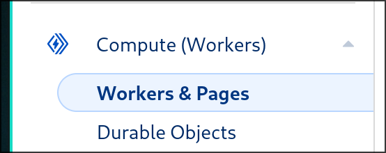
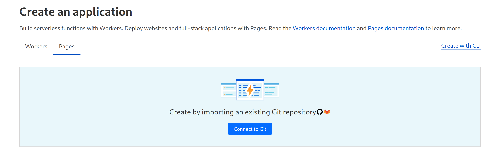
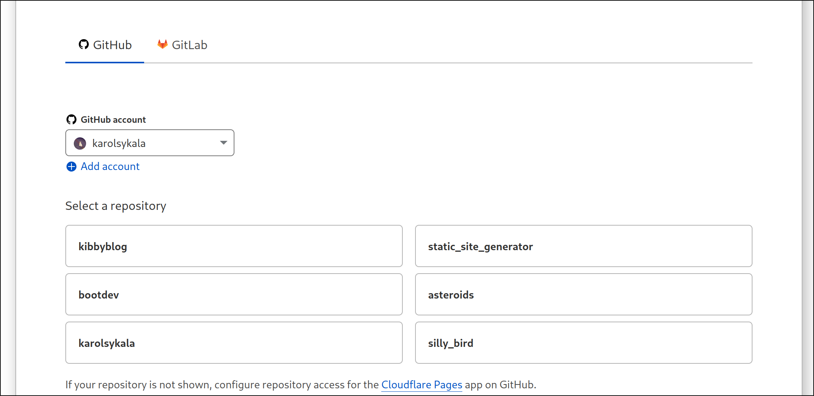
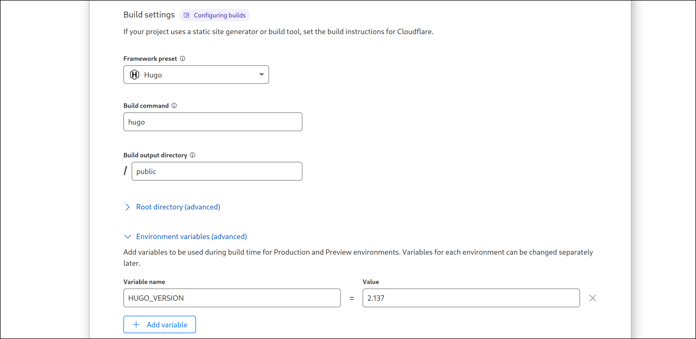
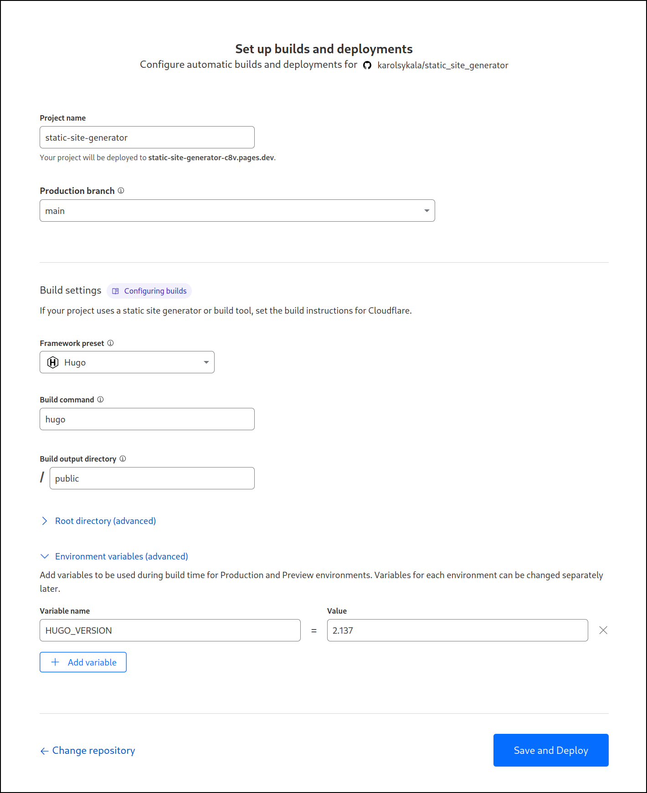
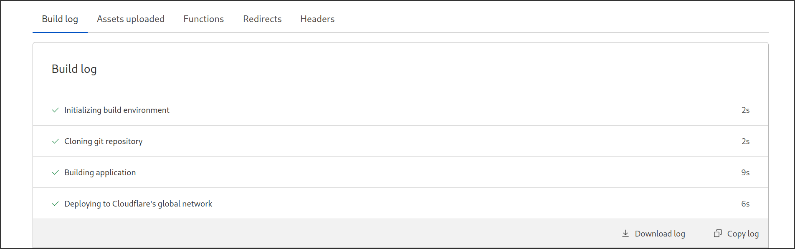

According to wise sages (aka the internet), the best way to learn something is by teaching it to others. So, why not embark on the noble quest of starting a blog today?

### What's a Static Site Generator?

In a world of bloated websites and laggy load times, Static Site Generators (SSGs) stand as the knights in shining armor. They create a site all at once and then deliver it in a flash—no lag, just pure performance.

#### Pros:
- **Performance**: Like a perfectly timed dodge in *Elden Ring*, static site generators pre-build the entire website and deliver it to the user all at once—no waiting around for things to load.
- **Customization**: You’re no longer chained to the whims of a CMS. With SSGs, you're free to craft whatever template your heart desires
- **Resource Efficiency**: These frameworks are lighter than a cat’s nap, so your website won’t require a ton of resources.
- **Markdown, hell yeah**: If you love the power of Markdown (like the freedom of the *Elden Ring* open world), you’re in for a treat.

#### Cons:
- **Interface**: Imagine trying to navigate the Lands Between without a map—yep, that's what working with an SSG feels like at first. You’ll need to read the documentation to figure out how things work, but once you get the hang of it, you will feel right at home.
- **Lack of Default Templates**: Out of the box, SSGs don't come with many templates. You'll either need to create your own or *venture into the wilds* of GitHub to find something to use.

*SSGs are powerful tools! If you want to learn more, check out this detailed breakdown from [Cloudflare](https://www.cloudflare.com/learning/performance/static-site-generator/).*

---

### What's Out There in the Land of Static Site Generators?

The world of Static Site Generators is vast, filled with many frameworks and options.
Here's the good news: you’ve got plenty of paths to explore. I’ve chosen [Hugo](https://gohugo.io/), which seems to be one of the most popular choices (even *boot.dev* uses it, so that’s like the *Golden Rune* of validation). At work, we've dabbled in a few other options, like WordPress, Google Pages, and Nextra. Each has its strengths, but in the end, it's all about finding the right fit for your *own  journey*.

---

### Why Hugo?

One of my personal quests in 2025 is to learn Go, and since Hugo is written in Go, it felt like the perfect opportunity to level up those skills in the real world. Bonus points: it's fully open-source (you know, like that sword you find in the middle of nowhere that no one tells you about).

Oh, and let's not forget the **cute custom themes**. I went with the [PaperMod](https://github.com/adityatelange/hugo-PaperMod/) theme, which I absolutely love. It’s simple, clean, and lets my content shine.

---

### Setting Up Your Hugo Website with Cloudflare Pages

Ready to embark on the setup journey? Here’s your guide to creating your Hugo-powered website using Cloudflare Pages.

#### Setup

1. Head to the [Hugo website](https://gohugo.io/), and choose your favorite theme. I went with [PaperMod](https://github.com/adityatelange/hugo-PaperMod/).
2. Before diving in, check the theme’s documentation for any specific requirements. For me, this meant heading over to the [PaperMod GitHub page](https://github.com/adityatelange/hugo-PaperMod/wiki/Installation) to make sure I wasn’t missing anything important.
3. Create a GitHub repository and link it to your local files. If you’re not familiar with Git yet, don't worry—learn it now. You’ll need it, trust me. Here’s a *side quest* in the form of a Git course by [thePrimeagen](https://www.youtube.com/watch?v=rH3zE7VlIMs)—go complete it before you continue. 
4. Once your repo is all set up, take a moment to look at the `config.yaml` file and make any customizations. This is your chance to tweak the theme to fit your personal aesthetic. 

#### Cloudflare Setup

1. Log into your Cloudflare account, and navigate to **Workers & Pages**.
   
2. Click **Pages**, then select **Connect to Git**.
   
3. Choose the repository that holds your Hugo website (for me, it’s called **kibbyblog**).
   
4. Select **Hugo** from the framework preset options. You can stick with the default settings unless your theme docs say otherwise. 
   **Important!** Some themes may require a specific Hugo version, higher or lower than what Cloudflare Pages uses. You can manually set the Hugo version with `HUGO_VERSION = <number>`. For PaperMod, I needed version 0.143.1 or higher, so that’s what I picked.
   
5. Once everything is set up, click **Save and Deploy**.
   

And voilà—your website is now live! Every time you push to the master branch, Cloudflare Pages will automatically rebuild your site and serve it under the URL `{your_project_name}.pages.dev`, or any custom domain you set up.

If you run into any issues along the way, don’t panic. Check the build logs for all the clues you need to debug any CI/CD problems. 

---

Now you’re ready to explore the vast world of static site generators and embrace your role as a blog creator. May your markdown be clean, your deployments swift, and may you never get stuck in an endless loop of errors (unless it's a fun one) :3

**Behold, cat!**

*A sip of coffee is but a small kindnenss.*
[Support me on Ko-fi! :3](https://ko-fi.com/mlem_dev)
